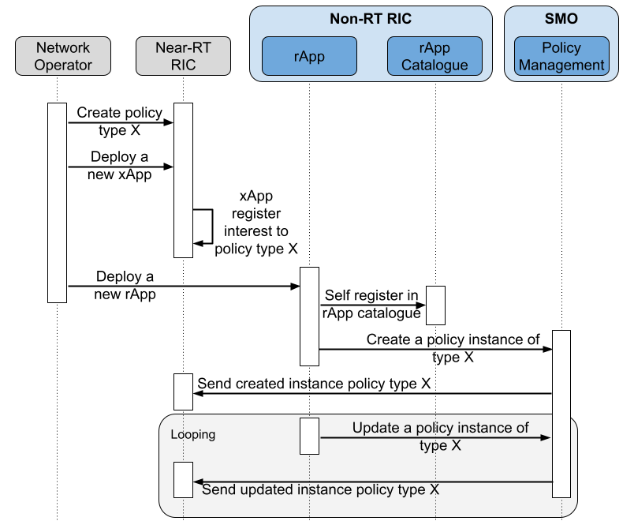

# Hello World Policy rApp in Python
This repository contains open-source code for a prototype python rAPP for Non Real-time RAN Intelligent Controller.

This rAPP aims to provide a basic implementation of:
1. rApp Catalogue: Interactions with rApp catalog to register and unregister the rApp.

2. A1 interface interactions: Interactions with the a1 interface to receive policy updates and send policy decisions.



## Introduction
This document provides guidelines on installing and configuring the HW Python rAPP in various environments/operating modes.
The audience of this document is assumed to have good knowledge of the RIC Platform, mainly Non-RT RIC.

## Preface
This rAPP can be run directly as a Linux binary, as a docker image, or in a pod in a Kubernetes environment.  The first
two can be used for dev testing. The last option is how an rApp is deployed in the RAN Intelligent Controller environment.
This covers all three methods. 

1. Docker 
2. Linux Binary
3. Kubernetes 

The Hello Word rApp can be tested as a Linux binary or a docker image.

1. **Linux binary**: The HW rAPP may be compiled and invoked directly. Pre-requisite software packages that must be installed before compiling are documented in the Dockerfile in the repository.

2. **Docker Image**: For building docker image, the Docker environment must be present in the system. The Dockerfile in the repository can be used to build the docker image. The docker image can be built using the following command:
```shell
docker build -t hw-python .
Sending build context to Docker daemon  13.13MB
Step 1/6 : FROM python:3.9-slim
 ---> ba55b0c3bfaa
Step 2/6 : COPY requirements.txt .
 ---> Using cache
 ---> 5527b2130292
Step 3/6 : RUN pip install -r requirements.txt
 ---> Using cache
 ---> f4243c137aa8
Step 4/6 : WORKDIR /app
 ---> Using cache
 ---> 318d5d04c230
Step 5/6 : COPY src/main.py .
 ---> e1c5f6b06bac
Step 6/6 : COPY src/pihw_template.json .
 ---> b992b1057ebb
Successfully built b992b1057ebb
Successfully tagged hw-python:latest
```
## Software Configuration

### Target Near-Real Time RIC
Firstly, you need to generate the policy type on the Near-Real Time RIC that will receive the policies. To achieve this, you can execute the following command on the Near-RT RIC.
Please note, you have the flexibility to modify the URL of the a1mediator as per your specific setup. The given example is compatible with the default configuration of release G in a Kubernetes environment.
```shell
curl -v -X PUT http://service-ricplt-a1mediator-http.ricplt.svc.cluster.local:10000/a1-p/policytypes/2 \
-H "Content-Type: application/json" \
-d '{
    "name": "hwpolicy",
    "description": "Hellow World policy type",
    "policy_type_id": 2,
    "create_schema": {
      "$schema": "http://json-schema.org/draft-07/schema#",
      "title": "HW Policy",
      "description": "Hello World Policy Type",
      "type": "object",
      "properties": {
        "threshold": {
          "type": "integer",
          "default": 0
        }
      },
      "additionalProperties": false
    }
  }'
```

Attention, if you are using Near-RT RIC version upper than release g, the API path is "A1-P/v2/policytypes"

### App Configurations

This YAML file houses configuration data for the nonrtric-rapp-helloworld application. The following keys require specific values:

1. mbase_url_rApp_catalogue: This key requires the base URL for the rApp Catalogue service. In this example, it's 'http://rappcatalogueservice.nonrtric.svc.cluster.local:9085/services'.

2. base_url_pms: This key designates the base URL for the Policy Management Service. In this instance, it's 'http://policymanagementservice.nonrtric.svc.cluster.local:9080/a1-policy/v2'.

3. type_to_use: This key represents the type to use. It's currently set to '2'.

4. ric_to_use: This key signifies the RIC (Radio Interface Controller) to use. Here, "ric4" is used.

5. body_type_to_use: This key indicates the body type to use, and it's set as '2' in this case.

6. body_path_to_use: This key refers to the path to the body file to be used. In this example, the path is 'nonrtric-rapp-helloword/src/pihw_template.json'.

7. policy_id_to_use: This key determines the policy ID to use. Here, it's specified as '1'.

Remember to replace these example values with your actual data per your application and infrastructure requirements.

```yaml
base_url_rApp_catalogue: 'http://rappcatalogueservice.nonrtric.svc.cluster.local:9085/services'
base_url_pms: 'http://policymanagementservice.nonrtric.svc.cluster.local:9080/a1-policy/v2'
type_to_use: '2'
ric_to_use: "ric4"
body_type_to_use: '2'
body_path_to_use: 'nonrtric-rapp-helloword/src/pihw_template.json'
policy_id_to_use: '1'
```

## App Deployment
You can run the Hello Word rAPP directly in your Linux environment or in a Kubernetes cluster. After the app's deployment, you can check the logs to see the interactions with the A1 interface. Basically, after the start, the rApp register in rApp catalog e and subscribe to the A1 interface. After that, the rApp updates policy type 2 and sends the policy decision to the A1 interface every 5 seconds.

```log
Using configurations from config.yaml.
base_url_rApp_catalogue: http://rappcatalogueservice.nonrtric.svc.cluster.local:9085/services
base_url_pms: http://policymanagementservice.nonrtric.svc.cluster.local:9080/a1-policy/v2
type_to_use: 2
ric_to_use: ric4
body_type_to_use: 2
body_path_to_use: pihw_template.json
policy_id_to_use: 1
Registering in rApp catalog  HelloWordrApp
{'policytype_ids': ['', '2']}
Updating policy: 1 threshold now: 163869198317292
Updating policy: 1 threshold now: 162083929207809
Updating policy: 1 threshold now: 378597595220780
Updating policy: 1 threshold now: 319625783247952
Updating policy: 1 threshold now: 649807735682618
Updating policy: 1 threshold now: 237166375393504
Updating policy: 1 threshold now: 816018675207609
Updating policy: 1 threshold now: 394616992669526
Updating policy: 1 threshold now: 743427568623713
Updating policy: 1 threshold now: 970478986324292
Updating policy: 1 threshold now: 772528662963631
```
### Linux Binary
To run in Linux, just run the python script as follows:
```shell
python3 src/main.py
```

### Kubernetes

To run in Kubernetes, just run helm command as follows:
```shell
helm install hw-python /helm/nonrtric-rapp-helloword
```

